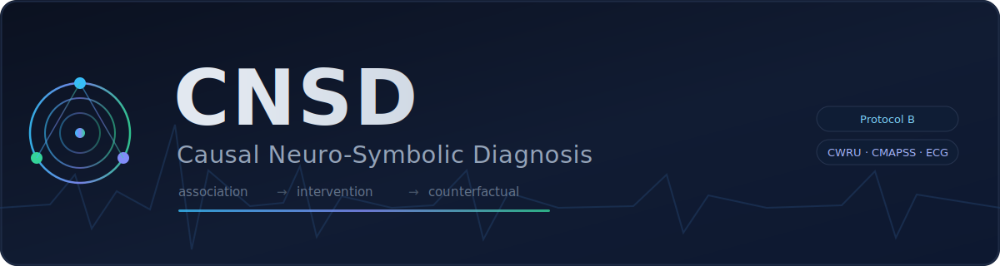
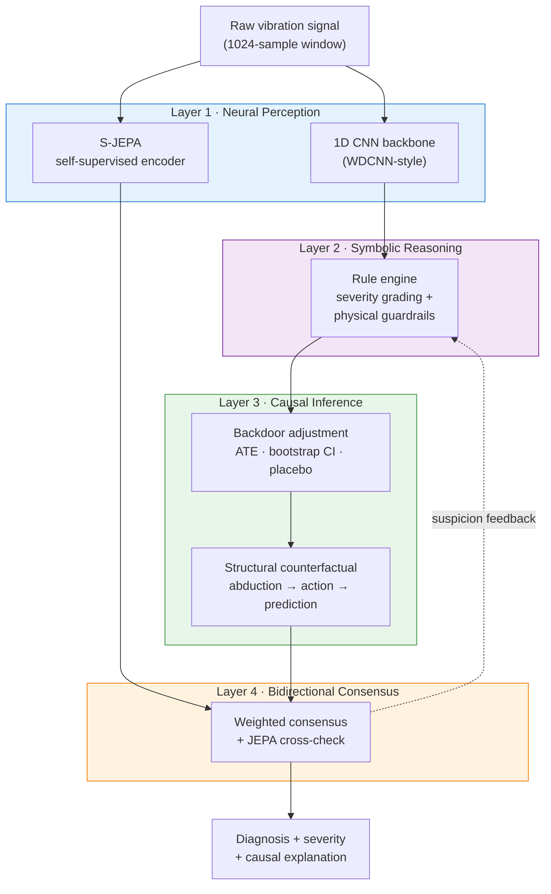
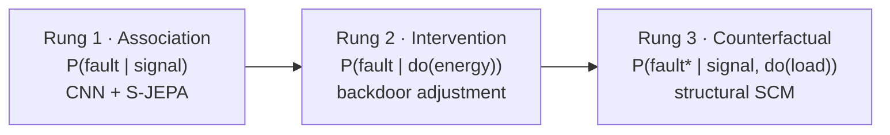

<div align="center">



*A five-layer bidirectional architecture for safety-critical fault diagnosis that*
*operationalizes all three rungs of Pearl's causal hierarchy — association, intervention, and counterfactual.*


-success)


</div>

---

CNSD is a diagnostic pipeline that does more than classify a fault: it grades the
fault's severity against physical rules, estimates the **causal** effect of the
underlying signal on the fault, and answers **counterfactual** ("what if the load
had been different?") questions about individual cases. It is evaluated under a
strict cross-load protocol on bearings (CWRU) and validated cross-domain on
turbofan engines (NASA C-MAPSS) and cardiac signals (MIT-BIH ECG).

This repository is the modular implementation of the CNSD research notebook.

## Table of Contents

- [Why CNSD](#why-cnsd)
- [Architecture](#architecture)
- [The Three Rungs](#the-three-rungs)
- [Results](#results)
- [Installation](#installation)
- [Quick Start](#quick-start)
- [Repository Structure](#repository-structure)
- [Reproducibility](#reproducibility)
- [Datasets](#datasets)
- [Limitations](#limitations)
- [Citation](#citation)
- [License](#license)

## Why CNSD

Most deep fault classifiers are accurate but opaque: they predict a label and stop.
For safety-critical machinery that is not enough — an operator needs to know *how
severe* a fault is, *why* the model believes it, and *what would change* the
outcome. CNSD addresses this by layering symbolic and causal reasoning on top of a
neural backbone, so a single forward pass yields a diagnosis, a severity grade, a
causal effect estimate, and a counterfactual explanation.

- **Leakage-free evaluation.** The headline numbers use Protocol B (cross-load):
  train on operating loads 0/1/2, test on the unseen load 3. No window-level overlap
  between train and test.
- **Cross-domain validation.** The causal layer produces consistent, significant
  effects on three structurally different domains (mechanical, turbofan, cardiac).
- **Honest negatives.** Where a component does not help — or a theoretical condition
  fails to hold — the result is reported, not hidden. See [Limitations](#limitations).

## Architecture

CNSD is a five-layer pipeline with a forward path (perception → reasoning → consensus)
and a backward suspicion signal that lets the consensus layer flag low-confidence
diagnoses for re-examination.



| Layer | Role | Module |
|-------|------|--------|
| 1 · Neural Perception | Classify the signal; learn a self-supervised representation | `core/architecture.py` |
| 2 · Symbolic Reasoning | Grade severity, veto physically impossible predictions | `core/rules.py` |
| 3 · Causal Inference | Estimate the causal effect; abduct counterfactuals | `core/causal.py`, `core/counterfactual.py` |
| 4 · Bidirectional Consensus | Reconcile neural / symbolic / causal evidence | `core/pipeline.py` |

## The Three Rungs

CNSD maps each reasoning layer onto a level of Pearl's causal hierarchy.



## Results

All numbers below are **expected reproduction targets** from the research notebook,
under Protocol B (cross-load) unless noted. Re-run `reproduce_results.py` on a GPU to
regenerate them; minor variation within seed noise is expected.

**Classification & published baselines (CWRU, weighted F1)**

| Method | F1 (Protocol B) |
|--------|:---:|
| WDCNN | 0.8815 ± 0.0046 |
| TICNN | 0.8720 ± 0.0269 |
| IRMv1 (best λ) | 0.8542 ± 0.1029 |
| **CNSD-CNN backbone** | **0.8784 ± 0.0063** |

The backbone is competitive with published baselines; CNSD's contribution is the
symbolic and causal reasoning layered on top, not a raw accuracy win.

**Causal inference (average treatment effect)**

| Domain | ATE | Placebo ratio | Significant |
|--------|:---:|:---:|:---:|
| CWRU (bearings) | −0.069 | > 100× | yes (p < 0.001) |
| C-MAPSS (turbofan) | significant | ~100× | yes |
| MIT-BIH (ECG) | significant | ~12× | yes |

Per-load ATE on CWRU ranges −0.062 to −0.074 (CV ≈ 0.066): the **direction is
invariant** across operating conditions while the magnitude varies, as expected of a
genuine causal effect.

**Continual learning (add classes 7–9, N = 100/class)**

| Method | Old-class acc | New-class acc | ATE drift |
|--------|:---:|:---:|:---:|
| Naive fine-tune | 0.9351 | 0.9972 | 0.1151 |
| EWC (best λ) | 0.9705 | 0.9860 | 0.1163 |
| Standard LoRA | 0.9410 | 0.8796 | 0.0000 |
| Causal Masked LoRA | 0.8955 | 0.8627 | 0.0000 |

Frozen-backbone methods have zero ATE drift **by construction** (the backbone never
changes), which is tautological for any frozen method. See
[Limitations](#limitations) regarding CCR-LoRA.

## Installation

Python 3.11 is recommended (matches the pinned TensorFlow 2.15 build).

```bash
git clone <your-repo-url>
cd CNSD
pip install -r requirements.txt
# or, as an editable package:
pip install -e .
```

## Quick Start

```bash
# 1. Fast plumbing check (CPU, ~5-15 min) — run this first
python smoke_test.py

# 2. Full reproduction of every table (GPU recommended — Kaggle/Colab T4)
python reproduce_results.py

# 3. Cross-domain pipeline (CWRU / C-MAPSS / MIT-BIH / MFPT)
python main.py
```

`smoke_test.py` runs every module on a tiny synthetic slice at 1 epoch to confirm the
repository wires together without errors. It does **not** produce real numbers — once
it passes, run `reproduce_results.py` on a GPU for the actual results.

**Minimal example — the causal layer on its own:**

```python
import numpy as np
from core.causal import analyze_causal, extract_feature_norms
from eval.classification import train_cnn
from data.loaders import load_cwru_all

X_tr, y_tr, load_tr, X_te, y_te, load_te = load_cwru_all()
cnn = train_cnn(X_tr, y_tr, seed=42, epochs=30)

# Treatment = CNN feature-norm ("vibration-energy" proxy), confounder = operating load
treatment = extract_feature_norms(cnn, X_tr)
result = analyze_causal(treatment, y_tr, load_tr, domain="CWRU")

print(result["ate"], result["ci"], result["placebo_ratio"])
```

## Repository Structure

```
CNSD/
├── core/                 # the five-layer architecture
│   ├── architecture.py   #   Layer 1 — CNN backbone + S-JEPA encoder
│   ├── rules.py          #   Layer 2 — symbolic rule engine
│   ├── causal.py         #   Layer 3 — backdoor adjustment, CATE, invariance
│   ├── counterfactual.py #   Layer 3 — structural counterfactuals
│   └── pipeline.py       #   Layer 4 — bidirectional consensus
├── data/
│   └── loaders.py        # CWRU, C-MAPSS, MIT-BIH, MFPT loaders
├── continual/
│   ├── cml.py            # Causal Masked LoRA (frozen-backbone)
│   ├── ccr_lora.py       # CCR-LoRA (partial adaptation — see Limitations)
│   └── experiment.py     # continual-learning comparison
├── eval/
│   ├── classification.py # Protocol B F1
│   ├── baseline.py       # WDCNN, TICNN, IRMv1
│   ├── ablation.py       # five-config ablation
│   ├── calibration.py    # ECE + Proposition 1
│   └── metrics.py        # ECE / monotonicity helpers
├── configs/
│   └── default.yaml      # hyperparameters
├── smoke_test.py         # fast plumbing check (CPU)
├── reproduce_results.py  # full reproduction (GPU)
└── main.py               # cross-domain pipeline
```

## Reproducibility

`reproduce_results.py` trains one canonical CNN, derives every shared signal from it
(predictions, confidences, feature norms, severities, JEPA agreement, exogenous noise,
ATE), and feeds all evaluation modules from that single model so the tables are
mutually consistent.

| Table | Function | Expected |
|-------|----------|----------|
| Classification | `evaluate_protocol_b` | F1 ≈ 0.8784 |
| Baselines | `run_published_baselines`, `run_irm` | WDCNN 0.8815 / TICNN 0.8720 / IRM 0.8542 |
| Causal ATE | `analyze_causal` | −0.069, placebo > 100× |
| CATE / invariance | `cate_by_group`, `causal_invariance_across_loads` | direction-invariant |
| Ablation | `run_ablation` | accuracy constant; consensus score moves |
| Calibration | `run_ece`, `run_proposition1` | ECE 0.0015 vs 0.2242; Prop. 1 violated |
| Continual | `run_continual_comparison` | see table above |

This is a GPU job. On a CPU laptop the full run is impractical (≈ a day or more); use
`smoke_test.py` locally and run the full reproduction on a free GPU.

## Datasets

| Dataset | Domain | Source | Notes |
|---------|--------|--------|-------|
| CWRU | Bearing vibration | Case Western Reserve University | downloaded automatically |
| C-MAPSS | Turbofan degradation | NASA Prognostics Data Repository | place files in `data/raw/cmapss/` |
| MIT-BIH | ECG arrhythmia | PhysioNet (via `wfdb`) | downloaded automatically |
| MFPT | Bearing vibration | Society for MFPT | **synthetic fallback only** (see below) |

When real data is unavailable, the C-MAPSS and MFPT loaders fall back to a
reproducible synthetic generator and print a clear `[SYNTHETIC]` warning. Numbers from
a synthetic fallback must not be reported as real-data results.

## Limitations

These are stated openly because honest reporting is part of the contribution.

- **CCR-LoRA is not yet validated.** The novel continual-learning method
  (`continual/ccr_lora.py`, partial adaptation targeting ATE drift < 0.01) has code but
  has not been run end-to-end. The reported continual-learning table covers only the
  frozen-backbone and fine-tuning baselines.
- **The causal treatment is a learned proxy.** The "vibration-energy" treatment is the
  CNN feature-norm, not a directly manipulable physical quantity. It is a
  representational proxy; the interventional interpretation should be read with that
  caveat.
- **The bidirectional consensus layer does not improve calibration or accuracy.**
  Expected Calibration Error is worse for the consensus score than for the raw softmax
  (0.2242 vs 0.0015), and bidirectional vs forward-only differs by < 0.001 in score. The
  consensus layer's value is in actionable explanation, not point-prediction.
- **Proposition 1's monotonicity condition is not supported on CWRU**
  (Spearman ρ ≈ 0.036, p ≈ 0.16). The theoretical condition is reported as failing
  rather than assumed to hold.
- **MFPT uses a synthetic fallback** unless real data is supplied (see above).

## Citation

If you use this work, please cite:

```bibtex
@misc{cnsd,
  title  = {CNSD: Causal Neuro-Symbolic Diagnosis for Safety-Critical Fault Detection},
  author = {Prasad, Abhimanyu},
  year   = {2026},
  note   = {Research artifact}
}
```

## License

Released under the MIT License.
