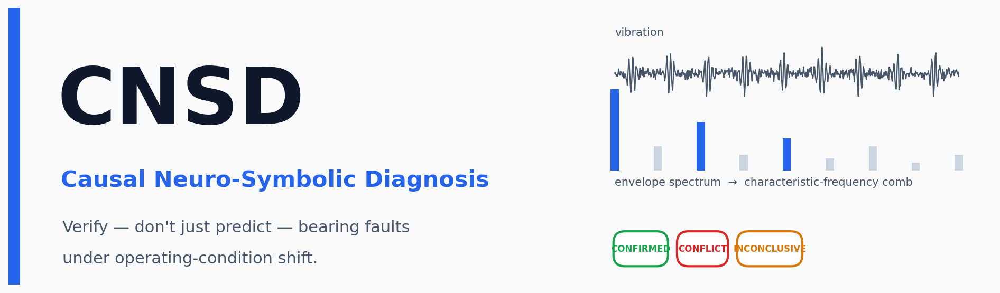
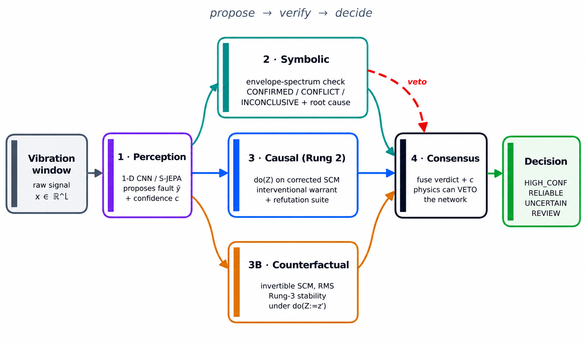
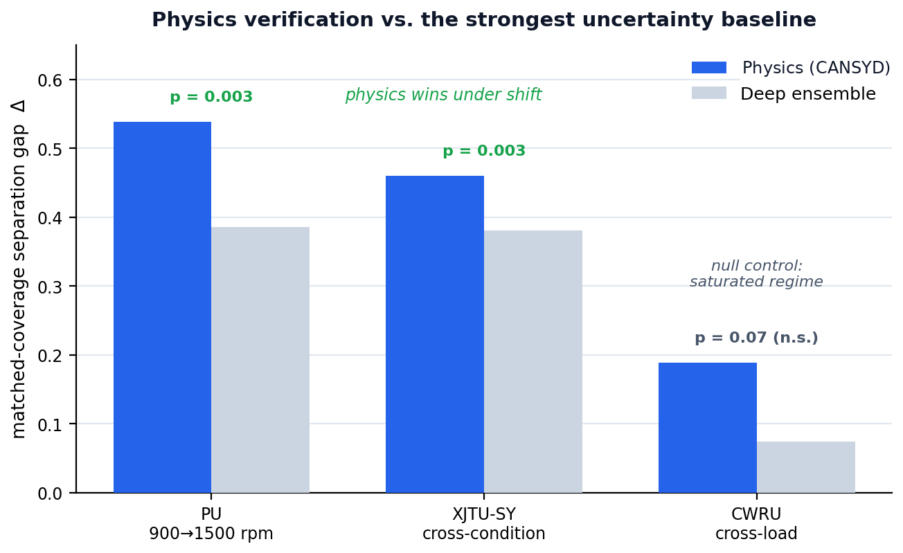

<div align="center">



<br>

[](LICENSE)
[](https://www.python.org/downloads/)
[](CHANGELOG.md)
[](.github/workflows)
[](https://github.com/astral-sh/ruff)
[](#citation)

**A five-layer framework that _verifies_ bearing-fault diagnoses against physics and causal structure — instead of trusting a neural network's confidence alone.**

[Quickstart](#-quickstart) · [How it works](#-how-it-works) · [Results](#-results) · [API](#-usage) · [Reproduce](#-reproducing-the-experiments) · [Citation](#-citation)

</div>

---

## What is CNSD?

**CNSD (Causal Neuro-Symbolic Diagnosis)** is a Python framework for diagnosing rolling-element **bearing faults** from vibration signals. A neural network proposes a diagnosis; then three independent layers check that proposal against the **physics of the signal** and the **causal structure of the machine**, and a consensus layer turns the result into an actionable maintenance decision.

The problem it solves is **operating-condition shift**: a model trained at one load or speed silently loses accuracy at another, and its confidence — the usual signal for "can I trust this prediction?" — is the first thing to break. CNSD answers a question a plain classifier cannot: *is this predicted fault physically present in the signal, and would it survive a change of operating condition?*

```python
from cnsd import CNSD, Dataset

data   = Dataset.from_arrays(signals, labels, condition, fs=12000)
report = CNSD().fit(data).diagnose(data)

print(report.summary())
#  HIGH_CONFIDENCE: 61%   RELIABLE: 22%   UNCERTAIN: 9%   MANUAL_REVIEW: 8%
#  physics verification rate: CONFIRMED 71% · CONFLICT 18% · INCONCLUSIVE 11%
```

> **Why it matters.** On two cross-domain benchmarks the physics layer is a **significantly better reliability signal than deep ensembles** (p < 0.005), and under heavy noise it catches **up to 100%** of the ensemble's confident mistakes. Where the task is easy, it honestly reports **no advantage** — see [Results](#-results).

---

## Table of Contents

- [Quickstart](#-quickstart)
- [How it works](#-how-it-works)
- [Results](#-results)
- [Features](#-features)
- [Installation](#-installation)
- [Usage](#-usage)
- [Configuration](#-configuration)
- [Repository structure](#-repository-structure)
- [Reproducing the experiments](#-reproducing-the-experiments)
- [Extending CNSD](#-extending-cnsd-to-new-machinery)
- [Project status & roadmap](#-project-status--roadmap)
- [Contributing](#-contributing)
- [Citation](#-citation)
- [License](#-license)

---

## 🚀 Quickstart

**Install** (core is dependency-light — no TensorFlow required to use the physics and causal tools):

```bash
pip install cnsd            # core
pip install "cnsd[all]"     # + perception (TensorFlow) and counterfactual (DoWhy)
```

**Diagnose a dataset in five lines.** Bring your own arrays — signals, labels, the operating condition per window, and the sampling rate:

```python
import numpy as np
from cnsd import CNSD, Dataset

X    = np.random.randn(200, 1024)          # 200 windows of 1024 samples
y    = np.random.randint(0, 10, 200)       # fault labels
cond = np.random.choice([0, 1, 2, 3], 200) # operating condition per window
data = Dataset.from_arrays(X, y, cond, fs=12000)

report = CNSD().fit(data).diagnose(data)

print(report.summary())
for statement in report.root_causes()[:5]:
    print(statement)   # e.g. "outer-race comb at 107 Hz (2 harmonics) supports predicted Outer fault"

print(f"{len(report.conflicts())} units flagged for review (physics disagrees with the network).")
```

Runnable versions live in [`examples/`](examples/): [`quickstart.py`](examples/quickstart.py), [`public_api_demo.py`](examples/public_api_demo.py), and [`unseen_data.py`](examples/unseen_data.py).

---

## 🧠 How it works

CNSD is a **propose → verify → decide** pipeline. The network only *proposes*; the diagnosis is not trusted until physics and causal reasoning have checked it.

<div align="center">

</div>

| Layer | Role | What it produces |
|------|------|------------------|
| **1 · Perception** | A 1-D CNN (or self-supervised **S-JEPA** backbone) classifies the vibration window. | predicted fault `ŷ`, confidence `c` |
| **2 · Symbolic** | Checks the prediction against the bearing's **characteristic frequencies** in the envelope spectrum. Independently names the fault family the *signal* supports. | verdict `CONFIRMED` / `CONFLICT` / `INCONCLUSIVE`, root cause, maintenance action |
| **3 · Causal (Rung 2)** | Estimates the interventional effect of the **operating condition** `do(Z)` on a corrected structural causal model (vibration does **not** cause the fault), with a refutation suite. | interventional warrant, CATE, invariance test |
| **3B · Counterfactual (Rung 3)** | On an invertible SCM, asks how the diagnosis would move under a different condition, using a continuous, model-independent severity outcome (RMS). | per-unit counterfactual stability |
| **4 · Consensus** | Fuses the network confidence with the physics verdict. **A physical conflict can veto a confident network.** | `HIGH_CONFIDENCE` / `RELIABLE` / `UNCERTAIN` / `MANUAL_REVIEW` |

**The core idea in one sentence:** a bearing defect strikes at a *characteristic frequency* fixed by geometry and shaft speed — a signature that is invariant to load by mechanical law, computable at any operating condition, and never consulted by a plain classifier. CNSD reads it directly and uses it to verify, and if necessary overrule, the network. See [`docs/architecture.md`](docs/architecture.md) for the full design.

---

## 📊 Results

Across three public bearing datasets, we compare reliability estimators at **matched coverage** (every estimator is allowed to trust the same number of predictions; the reported **gap Δ** is `accuracy(trusted) − accuracy(rest)`). Full log: [`EXPERIMENTS.md`](EXPERIMENTS.md).

<div align="center">

</div>

| Dataset | Regime | Physics Δ | Ensemble Δ | Physics vs. Ensemble | Verdict |
|---------|--------|-----------|------------|----------------------|---------|
| **PU** (900→1500 rpm) | shifted | **+0.538** | +0.386 | **p = 0.0032** | ✅ significant win |
| **XJTU-SY** (cross-condition) | shifted | **+0.460** | +0.381 | **p = 0.0028** | ✅ significant win |
| **CWRU** (cross-load) | saturated | +0.189 | +0.074 | p = 0.072 | ⚪ null (reported as control) |

**Noise robustness.** As additive noise increases, the physics layer catches the ensemble's *confident* errors: **100% at 0 dB on XJTU-SY**, ~40% on the saturated CWRU regime.

> **On the CWRU null.** We report it at equal prominence because it is *evidence*, not a weakness. CNSD's thesis is that mechanistic verification helps where the signal is degraded and the network is unsure — and adds nothing where predictions are already reliable. CWRU's cross-load task is comparatively saturated, so the absence of an advantage there is exactly what the mechanism predicts.

---

## ✨ Features

| | Feature | Detail |
|---|---------|--------|
| 🔬 | **Physics verification** | Envelope-spectrum check against BPFO/BPFI/BSF/FTF with harmonic aggregation and FFT-resolution-adaptive tolerance. |
| ⚖️ | **Three-valued verdict** | `CONFIRMED` / `CONFLICT` / `INCONCLUSIVE` — the engine *abstains* when the physics can't adjudicate, instead of guessing. |
| 🧾 | **Explainable output** | Every diagnosis carries a named component, characteristic frequencies, a root-cause statement, and a maintenance action. |
| 🎯 | **Runtime causal reasoning** | Pearl Rung-2 `do(Z)` intervention on a corrected SCM, with CATE, cross-load invariance, and a DoWhy refutation suite. |
| 🔮 | **Counterfactuals** | Pearl Rung-3 on an invertible SCM with a model-independent severity outcome; graceful sensitivity-analysis fallback. |
| 🛡️ | **Physics veto** | A confident-but-unsupported prediction is escalated to human review — the failure a confidence-only pipeline can't catch. |
| 🔌 | **Pluggable physics** | `bearing`, `gear`, and a zero-knowledge `spectral` provider behind one registry; add a mechanism with a single class. |
| 📦 | **Deployable** | Dependency-light core (no TensorFlow needed), one-call API, universal dataset contract, tested and packaged. |

---

## 📥 Installation

**Requirements:** Python ≥ 3.11.

```bash
# from PyPI (core only — numpy / scipy / scikit-learn / pyyaml)
pip install cnsd

# with optional extras
pip install "cnsd[perception]"      # 1-D CNN / S-JEPA backbone (TensorFlow, Keras)
pip install "cnsd[counterfactual]"  # Rung-3 counterfactuals (DoWhy, pandas, networkx)
pip install "cnsd[all]"             # everything
```

**From source** (for development or exact reproduction):

```bash
git clone https://github.com/abhiprd2000/CNSD.git
cd CNSD
pip install -e ".[all]"
# or pin the exact validated environment:
pip install -r requirements.txt
```

> The core install deliberately avoids heavy dependencies: `from cnsd.causal import intervention_effect_of_condition` and the physics engine work **without TensorFlow**. Only training the CNN perception layer needs the `perception` extra.

---

## 🛠️ Usage

CNSD exposes one clean object with four verbs.

### Diagnose

```python
from cnsd import CNSD, Dataset

model  = CNSD(config="cnsd_config.yaml")   # or CNSD() for defaults
report = model.fit(data).diagnose(data)

report.summary()             # decision + verification-rate breakdown
report.root_causes()         # human-readable root-cause statements
report.conflicts()           # units where physics disagrees with the network
report.verification_rate()   # CONFIRMED / CONFLICT / INCONCLUSIVE fractions
report.accuracy_by_verdict() # accuracy within each verdict bucket
```

### Explain — the causal warrant (Rung 2)

```python
effect = model.explain(data)   # interventional effect of the operating condition do(Z)
```

### What-if — a counterfactual (Rung 3)

```python
cf = model.what_if(data, intervention={"load": 0.8}, unit_index=0)
# "what severity would this unit have shown at load 0.8?"
```

### Inspect the structural causal model

```python
scm = model.scm_analysis(data)   # the fitted SCM behind the causal layers
```

---

## ⚙️ Configuration

CNSD is driven by a single YAML file. The taxonomy, sampling rate, and bearing geometry live in one place, so a new machine is onboarded by editing config — not code.

```yaml
# cnsd_config.yaml
dataset:
  name: "cwru"
  sampling_rate_hz: 12000
domain:
  type: "bearing"            # -> selects the bearing physics provider
physics:
  parameters:
    bearing_type: "6205-2RS"
    motor_load_rpm: { 0: 1797, 1: 1772, 2: 1750, 3: 1730 }
taxonomy:
  classes:
    0: ["Normal", null]
    7: ["Outer", 0.007]
    # ... (fault family, defect size in inches)
```

---

## 🗂️ Repository structure

```
CNSD/
├── README.md                   # you are here
├── LICENSE                     # MIT
├── cnsd_config.yaml            # example configuration
├── requirements.txt            # exact validated environment
├── setup.py / pyproject.toml   # packaging
├── cnsd/                       # the framework (installable package)
│   ├── api.py                  #   public CNSD class: diagnose / explain / what_if / scm_analysis
│   ├── builder.py              #   assembles the five-layer pipeline from config
│   ├── config.py               #   YAML config loader
│   ├── perception/             #   Layer 1 — 1-D CNN + S-JEPA backbone
│   │   └── cnn.py
│   ├── symbolic/               #   Layer 2 — physics verification engine
│   │   └── engine.py
│   ├── physics/                #   characteristic-frequency kinematics
│   │   ├── bearing.py          #     envelope analysis, harmonic prominence, adaptive tolerance
│   │   ├── gear.py
│   │   └── providers/          #     pluggable domain registry: bearing / gear / spectral
│   ├── scm/                    #   the corrected structural causal model
│   │   └── graph.py
│   ├── causal/                 #   Layer 3 — Rung-2 intervention, CATE, invariance
│   │   ├── estimators.py
│   │   └── refutation.py       #     DoWhy refutation suite (+ permutation fallback)
│   ├── counterfactual/         #   Layer 3B — Rung-3 counterfactual
│   │   ├── rung3.py
│   │   └── sensitivity.py      #     sensitivity-analysis fallback
│   ├── consensus/              #   Layer 4 — verdict + confidence -> decision
│   │   └── fusion.py
│   ├── datasets/               #   universal dataset contract + loaders
│   │   └── contract.py
│   └── diagnosis/              #   orchestration + the DiagnosisReport object
│       ├── system.py
│       └── report.py
├── validation/                 # reproducible cross-domain benchmarks
│   ├── multi_seed_benchmark.py #   20-seed physics-vs-ensemble benchmark
│   ├── validate_cwru.py
│   ├── validate_pu.py
│   └── validate_xjtusy.py
├── examples/                   # runnable usage demos
├── test/                       # test suite (runs without heavy deps)
├── docs/                       # documentation + README assets
│   ├── architecture.md         #   full design document
│   └── assets/                 #   README images (hero, architecture, results)
├── EXPERIMENTS.md              # the validation log (every run, incl. nulls)
├── CONTRIBUTING.md · CODE_OF_CONDUCT.md · SECURITY.md · MAINTAINERS.md
└── CHANGELOG.md
```

---

## 🔁 Reproducing the experiments

Every headline number in [`EXPERIMENTS.md`](EXPERIMENTS.md) comes from the `validation/` scripts. With a dataset prepared under `data/` (see per-script docstrings) and the pinned environment installed:

```bash
# 20-seed, matched-coverage physics-vs-ensemble benchmark
python -m validation.multi_seed_benchmark --dataset pu
python -m validation.multi_seed_benchmark --dataset xjtusy
python -m validation.multi_seed_benchmark --dataset cwru
```

Seeds are fixed (42–61); numbers should match within run-to-run noise. Data paths are overridable via the `CNSD_DATA_CWRU`, `CNSD_DATA_PU`, and `CNSD_DATA_SEU` environment variables.

---

## 🔧 Extending CNSD to new machinery

The physics layer is a registry of **providers**. `bearing` is validated here; `gear` and a zero-knowledge `spectral` fallback ship alongside it. A new mechanism is one class:

```python
from cnsd.physics.providers import register_provider, BaseProvider

class MyProvider(BaseProvider):
    def characteristic_frequencies(self, rpm, geometry): ...
    def dominant_family(self, envelope_spectrum): ...

register_provider("my_machine", MyProvider)
# now: domain.type = "my_machine" in cnsd_config.yaml
```

> **Scope note.** CNSD is validated on **bearings**, where the characteristic-frequency physics is exact. See [`EXPERIMENTS.md`](EXPERIMENTS.md) for all logs. 

---

## 📌 Project status & roadmap

CNSD is **v1.0.0** and one step from public release. The framework, physics/causal/counterfactual layers, and cross-domain benchmarks are complete and tested.

- [x] Five-layer pipeline with physics veto
- [x] Rung-2 intervention + refutation suite; Rung-3 counterfactual
- [x] Three-dataset cross-domain validation (PU, XJTU-SY, CWRU)
- [x] Pluggable provider registry; dependency-light core
- [ ] Gear-mesh provider (mechanism-agnostic verification)

......and continued.

See [`ROADMAP.md`](ROADMAP.md) for where CNSD is headed and how to help, and [`CHANGELOG.md`](CHANGELOG.md) for version history.

---

## 🤝 Contributing

Contributions are welcome. The workflow, integrity norms (honest nulls, no fabricated results, auto-generated artifacts), and review process are in [`CONTRIBUTING.md`](CONTRIBUTING.md). In short:

1. Fork → branch → make your change.
2. Run `ruff check . && ruff format .` and `pytest test/` before submitting.
3. Open a PR describing the change; CI must be green.

Please also read the [Code of Conduct](CODE_OF_CONDUCT.md) and, for vulnerabilities, the [Security Policy](SECURITY.md).

---

## 📝 Citation

If you use CNSD, please cite:

```bibtex
@software{cnsd2026,
  title   = {CNSD: Causal Neuro-Symbolic Diagnosis},
  author  = {Prasad, Abhimanyu and Mahmud, Kazi Tasfin},
  year    = {2026},
  url     = {https://github.com/abhiprd2000/CNSD},
  version = {1.0.0},
}
```


---

## 📄 License

Released under the [MIT License](LICENSE). © 2026 the CNSD authors.

---

<div align="center">
<sub>Built for machines that shouldn't fail silently.</sub>
</div>